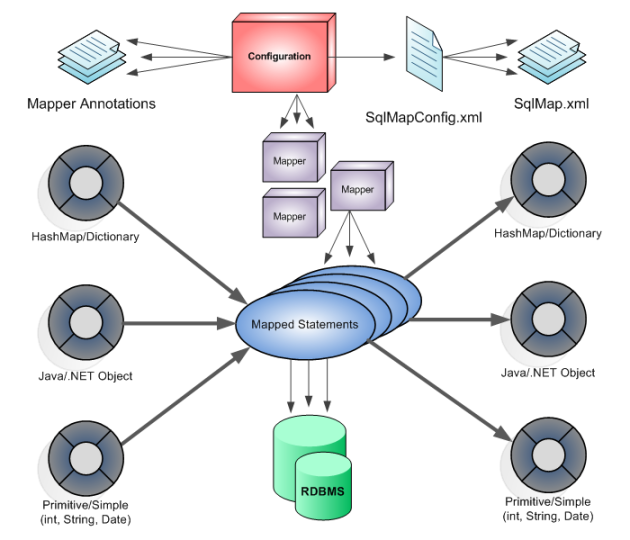

###                                                             Mybatis3 学习导航

#### 1. What is MyBatis

* MyBatis is a first class persistence framework with support for custom SQL, stored procedures and advanced mappings.

* MyBatis eliminates almost all of the JDBC code and manual setting of parameters and retrieval of results.

* MyBatis can use simple XML or Annotations for configuration and map primitives, Map interfaces and Java POJOs (Plain Old Java Objects) to database records.

#### 2. Some Details About MyBatis

* A JDBC Framework

* Developers write SQL, MYBATIS executes it using JDBC.

* An SQL Mapper

* Automatically maps object properties to prepared statement parameters.

* Automatically maps result sets to objects.

* Getting rid of N+1 queries.

* MyBatis will provide transaction management for database operations if no other transaction manager is available.

* MyBatis will use external transaction management (Spring, EJB CMT, etc.) if available.

* Great integration with Spring, but can also be used without Spring (the Spring folks were early supporters of iBATIS).

#### 3. What MyBatis Can not do

* An ORM Framework

* Does not generate SQL

* Does not have a proprietary query language

* Does not know about object identity

* Does not transparently persist objects

* Does not build an object cache

#### 4. MyBatis运行时的流程图

#### 5. 技术文档

* [官方文档](http://www.mybatis.org/mybatis-3/)

* [MyBatis Code Resource](https://github.com/mybatis/mybatis-3)

* [Mybatis Dynamic Sql](https://github.com/mybatis/mybatis-dynamic-sql)

* [MyBatis Sub Projects List](https://github.com/mybatis)

* [An Introduction to iBatis (MyBatis)](https://javamagic.wordpress.com/2012/02/22/an-introduction-to-ibatis-mybatis-an-alternative-to-hibernate-and-jdbc/)

* [Mybatis3 从入门到精通](http://mybatis.tk/)

